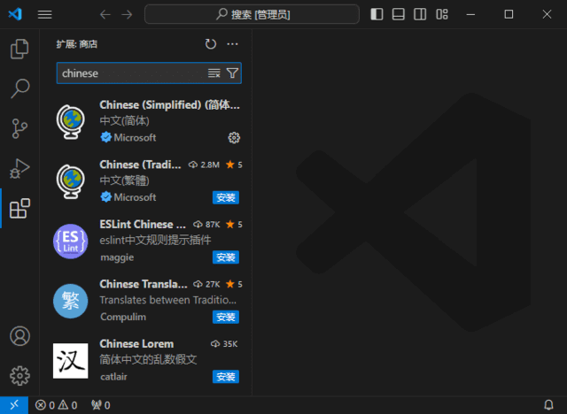

# 达芬奇DaVinci Resolve 21.1 专业版来了！史诗级更新 ，可以卸载AE/PR/PS了

## 简介

Adobe Illustrator 2026 是一款行业标准的矢量图形设计软件，广泛应用于插画制作、图标设计、徽标排版与商业包装印刷等领域。

## 软件信息

* **运行平台**：Windows 10 / 11 64位
* **软件版本**：v30.7.0.114
* **安装方式**：一键中文直装免激活版

---

## 📥 资源下载通道

> **下载说明**：
> 1. 请选择适合您下载速度的网盘通道（支持百度、夸克、迅雷）；
> 2. 软件解压若提示输入密码，请直接点击卡片上的「一键复制密码」即可。

